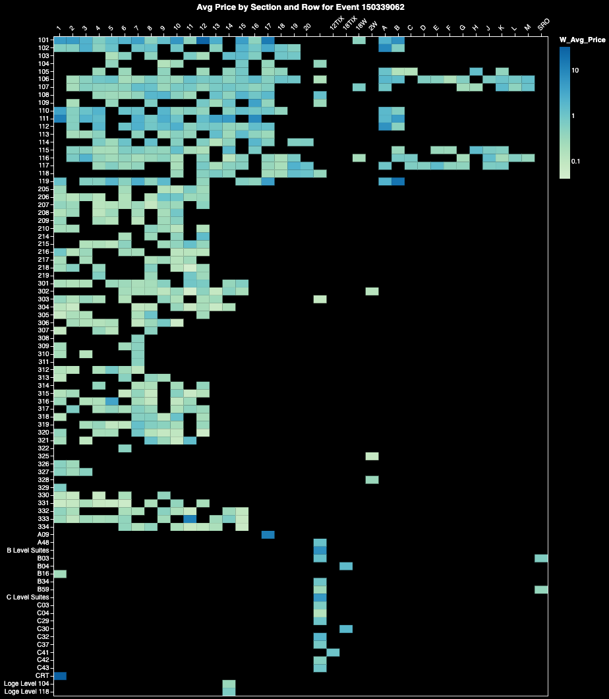
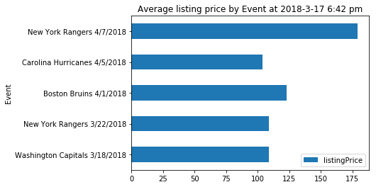
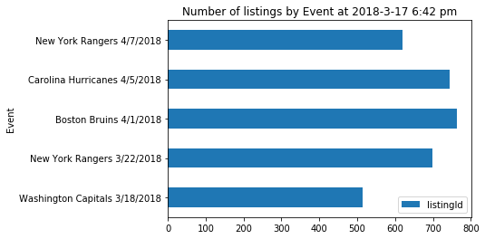
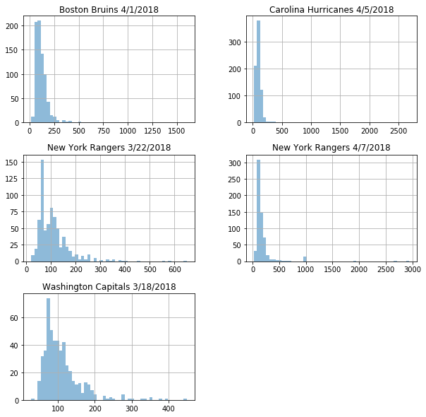

# Stubhub API

A Python wrapper for the stubhub inventory search API. You can see the full tutorial in the [Stubhub API.ipynb](https://nbviewer.jupyter.org/github/KobaKhit/stubhubAPI/blob/master/Stubhub%20API%20Tutorial.ipynb)



## Getting Started

```python
from stubhub_scraper import St

import pandas as pd
import numpy as np

## Enter user's API key, secret, and Stubhub login
app_token = '7131e534-bbec-374f-b1e4-1bdf6909a8ee'
consumer_key = 'jC475_MWRt6VV0aRz6nhA4Kpfloa'
consumer_secret = 'U7bW44Spj64CDYwUQSofJaMh1zka'
stubhub_username = ''
stubhub_password = ''
    
st = St(app_token,consumer_key,consumer_secret,stubhub_username,stubhub_password)
```

b'{"access_token":"254gce9e-3abd-3274-9d1f-13b7c3bf96b2","refresh_token":"1fdrf277-ac54-3d8d-b59b-58aa1482f7f4","scope":"default","token_type":"Bearer","expires_in":14846462}'

If authentication is succesfull you will see a message similar to above with your access token. 

## Single event

```python
# San Antonio at Golden State game on March 19th 2018 
listings = st.get_listings(103138286,pages=True)
listings[0]
```


    {'currentPrice': 46.9,
     'dirtyTicketInd': False,
     'listingId': 1314761532,
     'listingPrice': 37.0,
     'quantity': 2,
     'retrieveTime': '2018-03-17 20:21:08',
     'row': '14',
     'score': 0.0,
     'seatNumbers': '1;2',
     'sectionId': 127168,
     'sectionName': 'Balcony Corner 229',
     'sellerSectionName': '229',
     'zoneId': 7453,
     'zoneName': 'Balcony Corner'}


```python
# Number of listings
len(listings)
```


    298


`listings` is a list of dictionaries one of which you can see above. You can convert it to a dataframe and save as a csv.


```python
listings = pd.DataFrame(listings)
listings.head()
listings.to_csv('SpursvsWarriors 2018-3-19.csv')
```


<div>
<table border="1" class="dataframe">
  <thead>
    <tr style="text-align: right;">
      <th></th>
      <th>currentPrice</th>
      <th>dirtyTicketInd</th>
      <th>listingId</th>
      <th>listingPrice</th>
      <th>quantity</th>
      <th>retrieveTime</th>
      <th>row</th>
      <th>score</th>
      <th>seatNumbers</th>
      <th>sectionId</th>
      <th>sectionName</th>
      <th>sellerSectionName</th>
      <th>zoneId</th>
      <th>zoneName</th>
    </tr>
  </thead>
  <tbody>
    <tr>
      <th>0</th>
      <td>46.90</td>
      <td>False</td>
      <td>1314761532</td>
      <td>37.00</td>
      <td>2</td>
      <td>2018-03-17 20:21:08</td>
      <td>14</td>
      <td>0.0</td>
      <td>1;2</td>
      <td>127168</td>
      <td>Balcony Corner 229</td>
      <td>229</td>
      <td>7453</td>
      <td>Balcony Corner</td>
    </tr>
    <tr>
      <th>1</th>
      <td>50.49</td>
      <td>False</td>
      <td>1314385851</td>
      <td>39.99</td>
      <td>2</td>
      <td>2018-03-17 20:21:08</td>
      <td>13</td>
      <td>0.0</td>
      <td>20;21</td>
      <td>127149</td>
      <td>Balcony Baseline 201</td>
      <td>201</td>
      <td>7454</td>
      <td>Balcony Baseline</td>
    </tr>
    <tr>
      <th>2</th>
      <td>50.50</td>
      <td>False</td>
      <td>1284451304</td>
      <td>40.00</td>
      <td>2</td>
      <td>2018-03-17 20:21:08</td>
      <td>13</td>
      <td>0.0</td>
      <td>13;14</td>
      <td>127156</td>
      <td>Balcony Corner 204</td>
      <td>Balcony Corner 204</td>
      <td>7453</td>
      <td>Balcony Corner</td>
    </tr>
    <tr>
      <th>3</th>
      <td>56.50</td>
      <td>False</td>
      <td>1314437278</td>
      <td>45.00</td>
      <td>3</td>
      <td>2018-03-17 20:21:08</td>
      <td>18</td>
      <td>0.0</td>
      <td>General Admission</td>
      <td>127166</td>
      <td>Balcony Corner 227</td>
      <td>227</td>
      <td>7453</td>
      <td>Balcony Corner</td>
    </tr>
    <tr>
      <th>4</th>
      <td>57.70</td>
      <td>False</td>
      <td>1314744154</td>
      <td>46.00</td>
      <td>2</td>
      <td>2018-03-17 20:21:08</td>
      <td>15</td>
      <td>0.0</td>
      <td>7;8</td>
      <td>127166</td>
      <td>Balcony Corner 227</td>
      <td>227</td>
      <td>7453</td>
      <td>Balcony Corner</td>
    </tr>
  </tbody>
</table>
</div>


## Multiple events
To download listings for multiple events use `get_listings_by_event` function that takes the `events` parameter which is a pandas dataframe with event name and id in the following format.


```python
events = pd.read_csv('flyers events 2018.csv')
events
```


<div>
<table border="1" class="dataframe">
  <thead>
    <tr style="text-align: right;">
      <th></th>
      <th>Event</th>
      <th>Eventid</th>
    </tr>
  </thead>
  <tbody>
    <tr>
      <th>0</th>
      <td>Washington Capitals 3/18/2018</td>
      <td>103045481</td>
    </tr>
    <tr>
      <th>1</th>
      <td>New York Rangers 3/22/2018</td>
      <td>103045437</td>
    </tr>
    <tr>
      <th>2</th>
      <td>Boston Bruins 4/1/2018</td>
      <td>103045191</td>
    </tr>
    <tr>
      <th>3</th>
      <td>Carolina Hurricanes 4/5/2018</td>
      <td>103045229</td>
    </tr>
    <tr>
      <th>4</th>
      <td>New York Rangers 4/7/2018</td>
      <td>103045439</td>
    </tr>
  </tbody>
</table>
</div>


Let's get listings for the rest of Philadelphia Flyers home games in 2017-2018 season.


```python
flyers = st.get_listings_by_event(events)
```

    Event: New York Rangers 4/7/2018: : 5it [00:22,  4.52s/it]    

    Done getting listings by event.


    


```python
flyers.head()
```


<div>
<table border="1" class="dataframe">
  <thead>
    <tr style="text-align: right;">
      <th></th>
      <th>currentPrice</th>
      <th>dirtyTicketInd</th>
      <th>listingId</th>
      <th>listingPrice</th>
      <th>quantity</th>
      <th>retrieveTime</th>
      <th>row</th>
      <th>score</th>
      <th>seatNumbers</th>
      <th>sectionId</th>
      <th>sectionName</th>
      <th>sellerSectionName</th>
      <th>zoneId</th>
      <th>zoneName</th>
      <th>Event</th>
      <th>Date</th>
    </tr>
  </thead>
  <tbody>
    <tr>
      <th>0</th>
      <td>58.30</td>
      <td>False</td>
      <td>1314733573</td>
      <td>46.50</td>
      <td>2</td>
      <td>2018-03-17 20:21:20</td>
      <td>12</td>
      <td>0.0</td>
      <td>7;8</td>
      <td>30197</td>
      <td>Mezzanine Goal 219A</td>
      <td>UPPER:219A</td>
      <td>7747</td>
      <td>Mezzanine Goal</td>
      <td>Washington Capitals 3/18/2018</td>
      <td>3/18/2018</td>
    </tr>
    <tr>
      <th>1</th>
      <td>58.90</td>
      <td>False</td>
      <td>1314520843</td>
      <td>47.00</td>
      <td>2</td>
      <td>2018-03-17 20:21:20</td>
      <td>13</td>
      <td>0.0</td>
      <td>NA</td>
      <td>30190</td>
      <td>Mezzanine Goal 210A</td>
      <td>UPPER:210A</td>
      <td>7747</td>
      <td>Mezzanine Goal</td>
      <td>Washington Capitals 3/18/2018</td>
      <td>3/18/2018</td>
    </tr>
    <tr>
      <th>2</th>
      <td>58.90</td>
      <td>False</td>
      <td>1314471076</td>
      <td>47.00</td>
      <td>2</td>
      <td>2018-03-17 20:21:20</td>
      <td>8</td>
      <td>0.0</td>
      <td>15;16</td>
      <td>30199</td>
      <td>Mezzanine Goal 221</td>
      <td>UPPER:221</td>
      <td>7747</td>
      <td>Mezzanine Goal</td>
      <td>Washington Capitals 3/18/2018</td>
      <td>3/18/2018</td>
    </tr>
    <tr>
      <th>3</th>
      <td>58.90</td>
      <td>False</td>
      <td>1314718454</td>
      <td>47.00</td>
      <td>2</td>
      <td>2018-03-17 20:21:20</td>
      <td>11</td>
      <td>0.0</td>
      <td>NA</td>
      <td>30181</td>
      <td>Mezzanine Goal 205</td>
      <td>UPPER:205</td>
      <td>7747</td>
      <td>Mezzanine Goal</td>
      <td>Washington Capitals 3/18/2018</td>
      <td>3/18/2018</td>
    </tr>
    <tr>
      <th>4</th>
      <td>60.09</td>
      <td>False</td>
      <td>1314008638</td>
      <td>47.99</td>
      <td>2</td>
      <td>2018-03-17 20:21:20</td>
      <td>11</td>
      <td>0.0</td>
      <td>11;12</td>
      <td>30193</td>
      <td>Mezzanine Goal 217</td>
      <td>UPPER:217</td>
      <td>7747</td>
      <td>Mezzanine Goal</td>
      <td>Washington Capitals 3/18/2018</td>
      <td>3/18/2018</td>
    </tr>
  </tbody>
</table>
</div>


```
pd.unique(flyers['Event'])
```


    array(['Washington Capitals 3/18/2018', 'New York Rangers 3/22/2018',
           'Boston Bruins 4/1/2018', 'Carolina Hurricanes 4/5/2018',
           'New York Rangers 4/7/2018'], dtype=object)




Let's also look at the number of listings.



Below is a good visual to see how spread out the prices by event are.




## Reference

**`get_listings(eventid, pages=False)`** - Get listings using Stubhub API.

Parameters:
  - `eventid` (int) - eventid taken from the Stubhub event url.
  - `pages` (bool) - if True paginate to get all listings. If False get 200 listings.
  
**`get_listings_by_event(events)`** - Given the list of events and event ids retrieve all the listings for each event .

Parameters:
  - `events` (pandas DataFrame) - a pandas dataframe of events and event ids taken from stubhub.
 

## Resources

  - https://developer.stubhub.com/docs/StubHub+API+Developers+Guide.html
  - http://ozzieliu.com/2016/06/21/scraping-ticket-data-with-stubhub-api/
  - https://stubhubapi.zendesk.com/hc/en-us/articles/220922687-Inventory-Search
