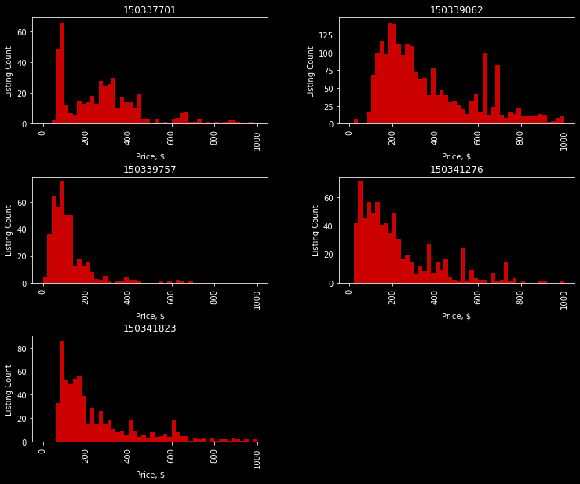

A Python wrapper for scraping listings from major ticket exchanges. You can see the tutorial for Stubhub in the [Stubhub API.ipynb](https://nbviewer.jupyter.org/github/KobaKhit/stubhubAPI/blob/master/Stubhub%20API%20Tutorial.ipynb)

**Listing Prices by Event**

# To Dos
  - [ ] Scrapers
    - [x] Stubhub
    - [ ] Seatgeek
    - [ ] Vividseats
    - [ ] TicketMaster - might be tricky
  - [ ] Documentation
  - [ ] Tests

